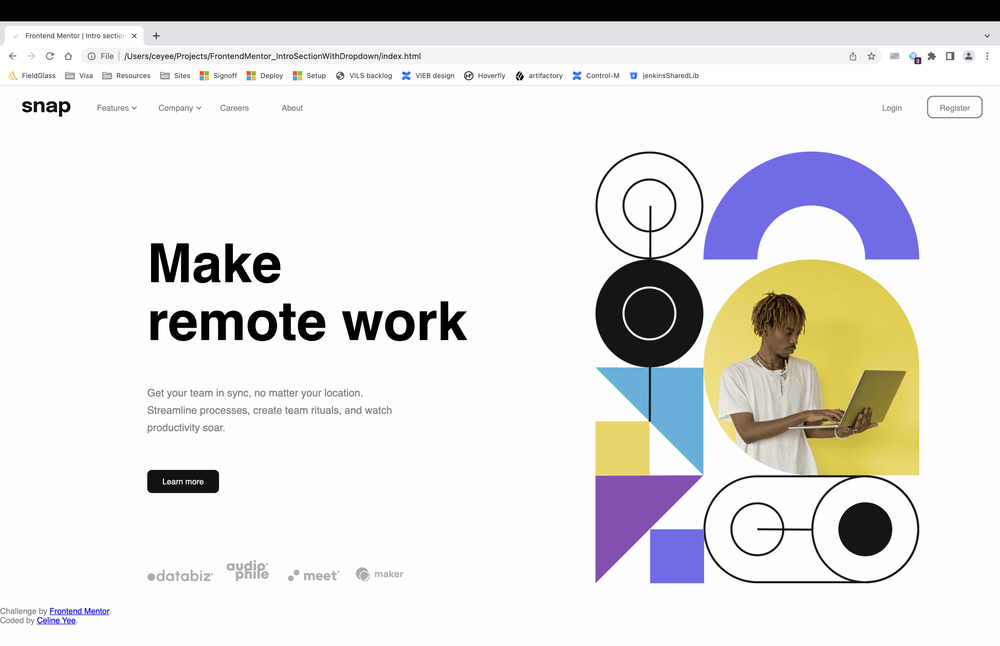
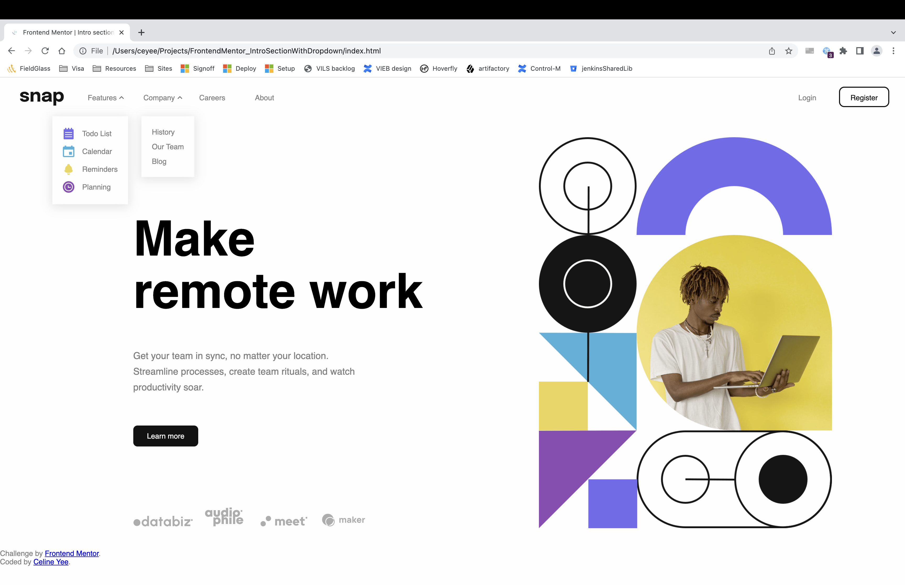
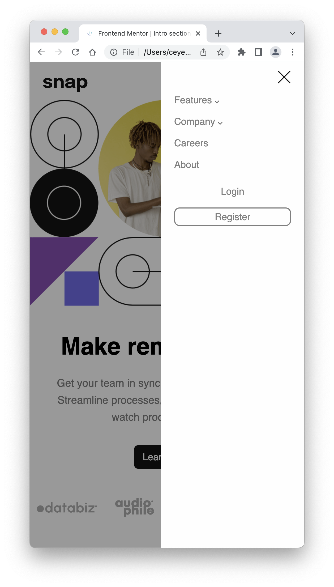
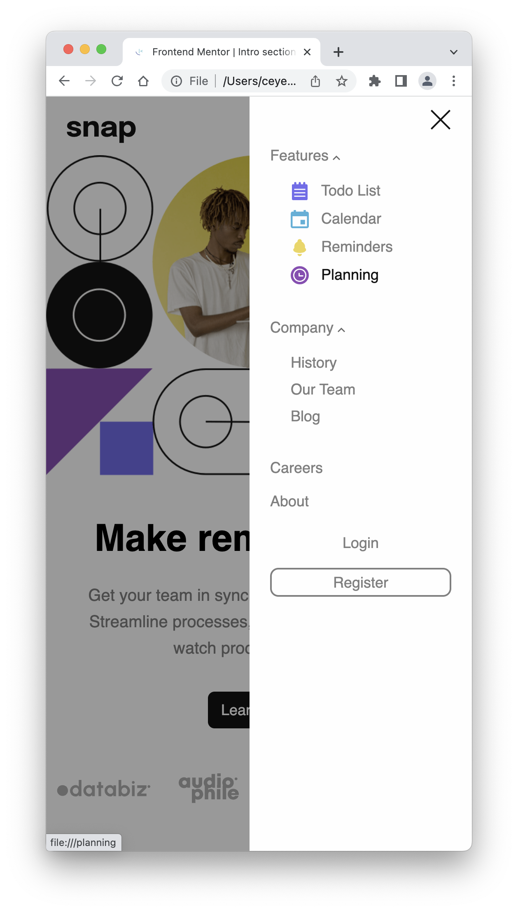

# Frontend Mentor - Intro section with dropdown navigation solution

This is a solution to
the [Intro section with dropdown navigation challenge on Frontend Mentor](https://www.frontendmentor.io/challenges/intro-section-with-dropdown-navigation-ryaPetHE5)
. Frontend Mentor challenges help you improve your coding skills by building realistic projects.

## Table of contents

- [Overview](#overview)
    - [The challenge](#the-challenge)
    - [Screenshot](#screenshot)
    - [Built with](#built-with)
- [Author](#author)

**Note: Delete this note and update the table of contents based on what sections you keep.**

## Overview

### The challenge

Users should be able to:

- View the relevant dropdown menus on desktop and mobile when interacting with the navigation links
- View the optimal layout for the content depending on their device's screen size
- See hover states for all interactive elements on the page

### Screenshot

**Desktop Designs**

|    **Page**     |   
**Reference**
    | 
**Implementation**
 |
|:---------------:|:-------------------------------------------------:|:-------------------------------------------------:|
| Desktop Design  |           |                 |
| Desktop Active  |            |          |

**Mobile Designs**

|        **Page**        |                             **Reference**                             |                           **Implementation**                           |
|:----------------------:|:---------------------------------------------------------------------:|:----------------------------------------------------------------------:|
|     Mobile Design      |           |                  |
| Mobile Menu Collapsed  |   |   |
|  Mobile Menu Expanded  |    |    |

### Built with

- Semantic HTML5 markup
- CSS
- Javascript

## Author

- Website - [Celine Yee](https://sg.linkedin.com/in/celine-yee-30763217a)
- Frontend Mentor - [@cmetramexs](https://www.frontendmentor.io/profile/cmetramexs)
